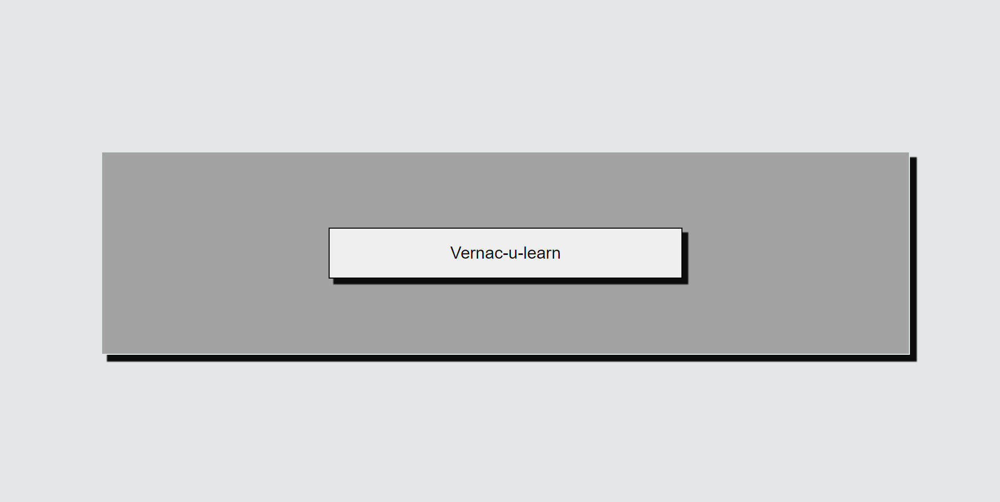
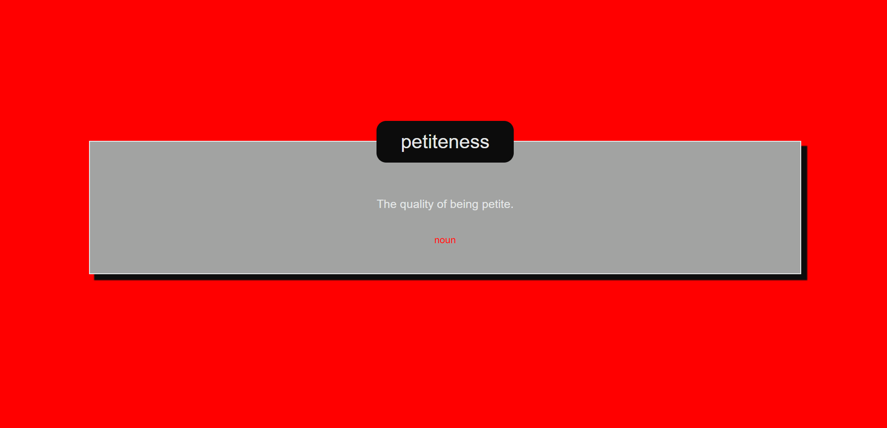
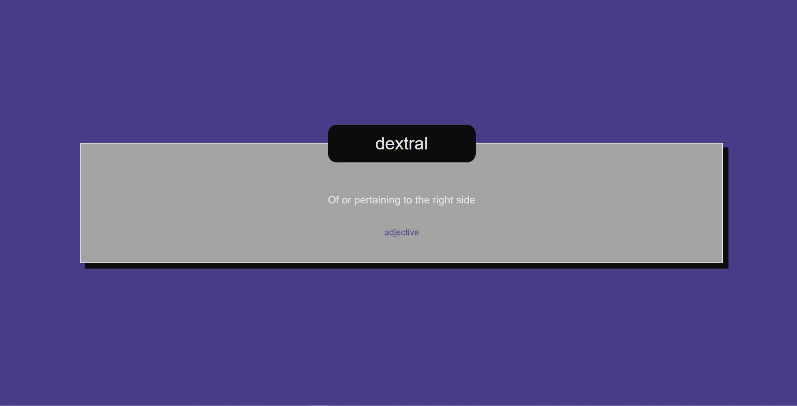

<details open="open">
  <summary><h2 style="display: inline-block">Table of Contents</h2></summary>
  <ol>
    <li>
      <a href="#about-the-project">About The Project</a>
      <ul>
        <li><a href="#built-with">Built With</a></li>
      </ul>
    </li>
    <li>
      <a href="#getting-started">Getting Started</a>
      <ul>
        <li><a href="#prerequisites">Prerequisites</a></li>
        <li><a href="#installation">Installation</a></li>
      </ul>
    </li>
    <li><a href="#usage">Usage</a></li>
    <li><a href="#license">License</a></li>
    <li><a href="#contact">Contact</a></li>
    <li><a href="#acknowledgements">Acknowledgements</a></li>
  </ol>
</details>
 


## About The Project
Vernac-u-Learn










Click "Vernac-u-Learn" to learn about a random word and its definition! 

* [https://zd092718.github.io/vernac-u-learn/]()
* [https://github.com/Zd092718/vernac-u-learn.git]()

### Built With

* HTML
* CSS
* Javascript
* Bootstrap
* Wordnik API
* Lingua robot API


<!-- GETTING STARTED -->
## Getting Started

To get a local copy up and running follow these simple steps.

### Prerequisites

This is an example of how to list things you need to use the software and how to install them.
* Gitbash
* VS code

### Installation

1. Clone the repo
   ```sh
   git clone git@github.com:Zd092718/vernac-u-learn.git
   ```


## Usage

Expand your vernacular! 


## License

Distributed under the MIT License. See `LICENSE` for more information.


## Contact

Zack Dowd - [zdowd2796@gmail.com](zdowd2796@gmail.com)

Micah Conn - [mcoxconn@gmail.com](mcoxconn@gmail.com)

Kyle McWilliams - [mcwilliams.kylel@gmail.com](mcwilliams.kylel@gmail.com)

Jordan soh - [Jordansoh14@gmail.com](Jordansoh14@gmail.com)

Project Link: [Project link](https://zd092718.github.io/vernac-u-learn/)


## Acknowledgements

* [othneildrew README template](https://github.com/othneildrew/Best-README-Template)
* [Wordnik API Documents](https://developer.wordnik.com/docs)
* [Lingua Robot API Documents](https://linguarobot.docs.apiary.io/#) 